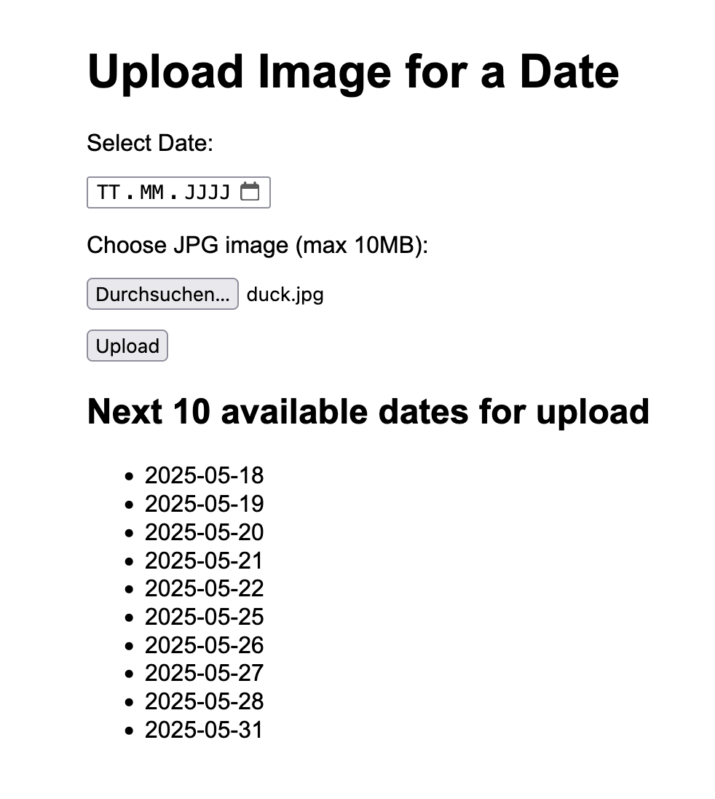

# 🖌️ inkday


A 3D printable frame for a 7.5" e-ink display a website to control its content.

Upload images via the website's calendar interface. Choose one image for each day.

<details>
<summary>Website Screenshot (click to expand)</summary>



</details>

## 📦 Hardware Requirements

- 7.5" WaveShare e-ink display
- Raspberry Pi 3B+ with power supply and WiFi connection
- 3D printer (you can also use an online service to print the frame)
- A server for the website (e.g. Pi itself)

## 🖐️ Usage

### 1. Printing the Frame

The frame (`./frame/inkday-frame.stl`) is designed to be printed in one piece, supports are optional.

### 2. Assembling the Frame

TODO

### 3. Run the Server

Run the docker container:

```bash
docker run -d -p 80:1313 -v /path/to/inkday-data:/data ghcr.io/jflessau/inkday:latest
```

This starts the server on port 80 and mount the `/path/to/inkday-data` directory to the container's `/data` directory, where the images are stored.
Images will be resized to fit the display (`800x480 px`).

### 4. Connect Pi & Server

Put `./frame/frame.py` on your Pi, set the environment variable `SERVER_URL` to the URL of the server (e.g. `http://localhost:80`), and run it with `python3 frame.py`.
